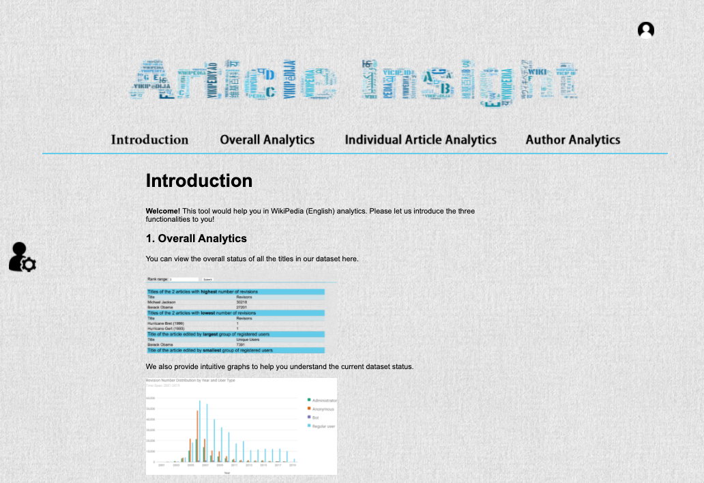

# Article Insight

A simple website that collects and analyzes data from WikiPedia API. An assignment of a web development course.

Live deployment: [Amazon Web Services](http://ec2-54-252-170-213.ap-southeast-2.compute.amazonaws.com:3000/)

Features:
- Developped with MEAN framework
- Overall analytics, individual article analytics and author analytics
- Data visualization with Google Charts
- Additional feature besides requirements: adding new article entries to database by inputting article names
- Additional feature besides requirements: article preview with coursor hover

---

# 文章分析

一个简单的用于收集并分析来自维基百科API的数据的网站。一个网站开发课程的作业。

在线部署：[Amazon Web Services](http://ec2-54-252-170-213.ap-southeast-2.compute.amazonaws.com:3000/)

功能：
- 使用MEAN框架开发
- 总体分析、个体文章分析和作者分析
- 使用Google Charts进行了数据可视化
- 作业要求之外的额外功能：输入文章名来增加新的文章条目到数据库
- 作业要求之外的额外功能：鼠标悬停时的文章预览

